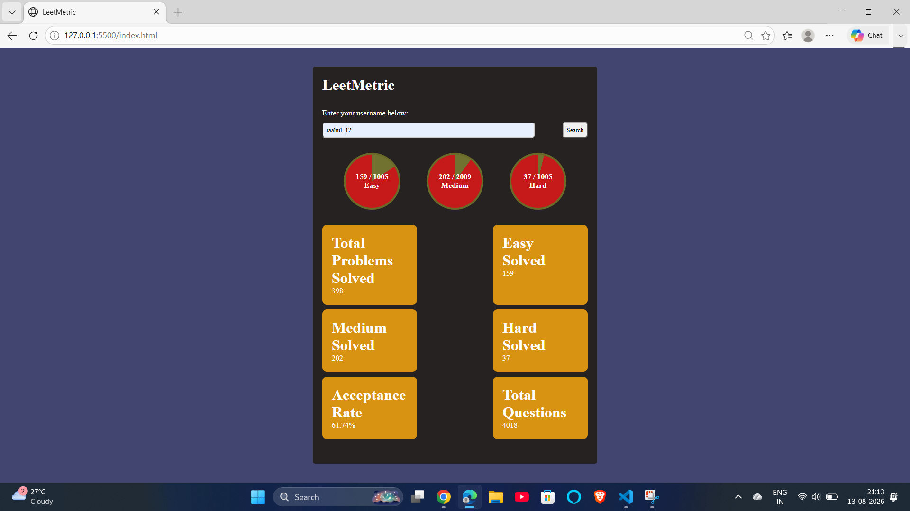

# 🚀 LeetMetrics

LeetMetrics is a simple and interactive web application that allows users to search for a **LeetCode username** and view their coding statistics in a clean dashboard.

The project is built using **HTML, CSS, and JavaScript** and uses a LeetCode statistics API to fetch and display user data dynamically.

---

## 📸 Project Preview


---

## ✨ Features

* 🔍 Search LeetCode users by username
* 📊 Display total problems solved
* 🟢 Easy problems solved
* 🟡 Medium problems solved
* 🔴 Hard problems solved
* 📈 Display acceptance rate
* 📝 Display total available questions
* ⭕ Visual progress indicators for problem difficulty
* ⚡ Fetches data dynamically using JavaScript
* ⌨️ Supports searching using the **Enter** key
* 📱 Simple and clean user interface
* ❌ Handles invalid usernames and API errors

---

## 🛠️ Technologies Used

| Technology | Purpose                               |
| ---------- | ------------------------------------- |
| HTML5      | Structure of the web application      |
| CSS3       | Styling and responsive UI             |
| JavaScript | Application logic and API integration |
| REST API   | Fetching LeetCode statistics          |

---

## 🔌 API

LeetMetrics uses the **LeetCode Stats API** to retrieve user statistics.

The application sends the searched username to the API and processes the returned data to display:

* Total Problems
* Total Solved
* Easy Solved
* Medium Solved
* Hard Solved
* Acceptance Rate

---

## 📂 Project Structure

```text
LeetMetrics/
│
├── assets/
│   ├── leetmetrics-dashboard.png
│   └── status.png        
│
├── index.html
├── style.css
├── script.js
└── README.md
```
## 📊 Project Status



---

## ⚙️ How to Run Locally

### 1. Clone the repository

```bash
git clone https://github.com/rahul-nishad5708/Leetmetrics.git
```

### 2. Open the project

```bash
cd LeetMetrics
```

### 3. Run the application

Since this is a frontend project, you can simply open:

```text
index.html
```

in your web browser.

### Recommended

You can also use the **Live Server** extension in VS Code.

1. Open the project in VS Code.
2. Install the **Live Server** extension.
3. Right-click `index.html`.
4. Select **Open with Live Server**.

---

## 🖥️ How It Works

```text
Enter LeetCode Username
          ↓
     Validate Username
          ↓
      Send API Request
          ↓
    Receive User Statistics
          ↓
     Process API Response
          ↓
   Display Statistics Dashboard
```

---

## 📊 Statistics Displayed

### Problem Solving

The dashboard displays the number of problems solved in different difficulty levels:

* **Easy**
* **Medium**
* **Hard**

### User Statistics

The application also displays:

* Total Problems Solved
* Total Questions
* Acceptance Rate

---

## 🎯 Example

Enter a valid LeetCode username:

```text
raahul_12
```

Then click:

```text
Search
```

The application fetches the user's available statistics and displays them on the dashboard.

---

## 🧠 What I Learned

While building this project, I practiced:

* DOM manipulation with JavaScript
* JavaScript event listeners
* Fetch API
* Working with REST APIs
* Handling asynchronous operations with `async/await`
* JSON data processing
* Dynamic HTML element creation
* Form/input validation
* Error handling
* CSS progress indicators
* Building a frontend project from scratch

---

## 🔮 Future Improvements

Some features that can be added in future versions:

* 🌙 Dark/Light mode
* 👥 Compare two LeetCode users
* 📅 Display recent submissions
* 📈 Add performance charts
* 🏆 Display contest rating
* 🔥 Display current streak
* 📱 Improve mobile responsiveness
* 💾 Save previously searched usernames
* 🎨 Improve dashboard UI and animations

---

## 🚧 Error Handling

LeetMetrics handles common errors such as:

* Empty username
* Invalid username format
* User not found
* API request failure
* API response errors

If the API request fails, the application displays an appropriate error message instead of crashing.

---

## 📌 Project Status

**Completed ✅**

The current version supports searching for a LeetCode username and displaying the available statistics through the API.

---

## 👨‍💻 Author

**Rahul Nishad**

B.Tech Computer Science Student

---

## ⭐ Support

If you found this project useful, consider giving the repository a ⭐ on GitHub.

---

## 📄 License

This project is created for **learning and educational purposes**.
