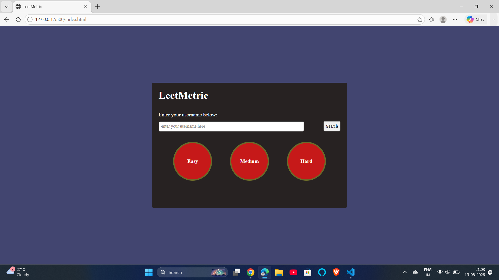

# LeetMetrics

LeetMetrics is a web-based application that allows users to view and analyze their LeetCode profile statistics in a simple and interactive dashboard.

## 📸 Screenshots



## ✨ Features

- 🔍 Search LeetCode user profiles
- 📊 Display solved problems statistics
- 🟢 Easy / Medium / Hard problem breakdown
- 📈 User performance statistics
- 🎨 Clean and responsive user interface
- ⚡ Fast and simple JavaScript-based application

## 🛠️ Technologies Used

- HTML5
- CSS3
- JavaScript
- LeetCode API

## 🚀 How to Run

1. Clone the repository:

   ```bash
   git clone https://github.com/rahul-nishad5708/Leetmetrics.git